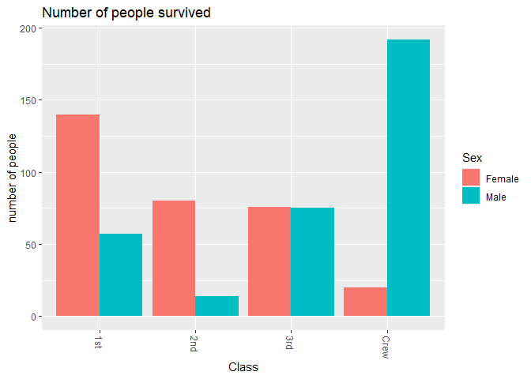
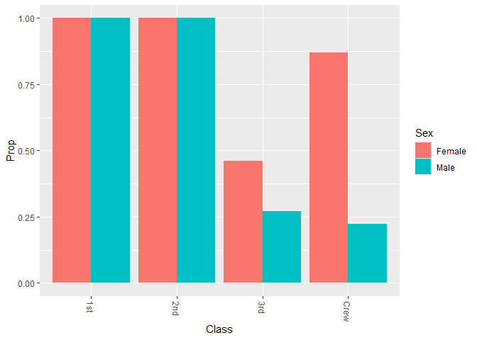
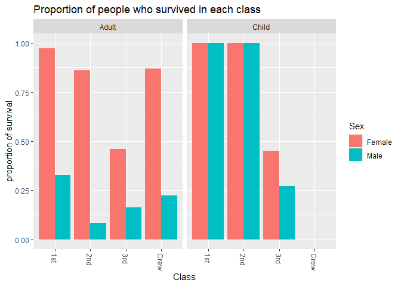

RMS Titanic
================
Khor Zhi Hong
2020-4-29

- [Grading Rubric](#grading-rubric)
  - [Individual](#individual)
  - [Submission](#submission)
- [First Look](#first-look)
  - [**q1** Perform a glimpse of `df_titanic`. What variables are in
    this
    dataset?](#q1-perform-a-glimpse-of-df_titanic-what-variables-are-in-this-dataset)
  - [**q2** Skim the Wikipedia article on the RMS Titanic, and look for
    a total count of souls aboard. Compare against the total computed
    below. Are there any differences? Are those differences large or
    small? What might account for those
    differences?](#q2-skim-the-wikipedia-article-on-the-rms-titanic-and-look-for-a-total-count-of-souls-aboard-compare-against-the-total-computed-below-are-there-any-differences-are-those-differences-large-or-small-what-might-account-for-those-differences)
  - [**q3** Create a plot showing the count of persons who *did*
    survive, along with aesthetics for `Class` and `Sex`. Document your
    observations
    below.](#q3-create-a-plot-showing-the-count-of-persons-who-did-survive-along-with-aesthetics-for-class-and-sex-document-your-observations-below)
- [Deeper Look](#deeper-look)
  - [**q4** Replicate your visual from q3, but display `Prop` in place
    of `n`. Document your observations, and note any new/different
    observations you make in comparison with q3. Is there anything
    *fishy* in your
    plot?](#q4-replicate-your-visual-from-q3-but-display-prop-in-place-of-n-document-your-observations-and-note-any-newdifferent-observations-you-make-in-comparison-with-q3-is-there-anything-fishy-in-your-plot)
  - [**q5** Create a plot showing the group-proportion of occupants who
    *did* survive, along with aesthetics for `Class`, `Sex`, *and*
    `Age`. Document your observations
    below.](#q5-create-a-plot-showing-the-group-proportion-of-occupants-who-did-survive-along-with-aesthetics-for-class-sex-and-age-document-your-observations-below)
- [Notes](#notes)

*Purpose*: Most datasets have at least a few variables. Part of our task
in analyzing a dataset is to understand trends as they vary across these
different variables. Unless we’re careful and thorough, we can easily
miss these patterns. In this challenge you’ll analyze a dataset with a
small number of categorical variables and try to find differences among
the groups.

*Reading*: (Optional) [Wikipedia
article](https://en.wikipedia.org/wiki/RMS_Titanic) on the RMS Titanic.

<!-- include-rubric -->

# Grading Rubric

<!-- -------------------------------------------------- -->

Unlike exercises, **challenges will be graded**. The following rubrics
define how you will be graded, both on an individual and team basis.

## Individual

<!-- ------------------------- -->

| Category | Needs Improvement | Satisfactory |
|----|----|----|
| Effort | Some task **q**’s left unattempted | All task **q**’s attempted |
| Observed | Did not document observations, or observations incorrect | Documented correct observations based on analysis |
| Supported | Some observations not clearly supported by analysis | All observations clearly supported by analysis (table, graph, etc.) |
| Assessed | Observations include claims not supported by the data, or reflect a level of certainty not warranted by the data | Observations are appropriately qualified by the quality & relevance of the data and (in)conclusiveness of the support |
| Specified | Uses the phrase “more data are necessary” without clarification | Any statement that “more data are necessary” specifies which *specific* data are needed to answer what *specific* question |
| Code Styled | Violations of the [style guide](https://style.tidyverse.org/) hinder readability | Code sufficiently close to the [style guide](https://style.tidyverse.org/) |

## Submission

<!-- ------------------------- -->

Make sure to commit both the challenge report (`report.md` file) and
supporting files (`report_files/` folder) when you are done! Then submit
a link to Canvas. **Your Challenge submission is not complete without
all files uploaded to GitHub.**

``` r
library(tidyverse)
```

    ## ── Attaching core tidyverse packages ──────────────────────── tidyverse 2.0.0 ──
    ## ✔ dplyr     1.1.4     ✔ readr     2.1.5
    ## ✔ forcats   1.0.0     ✔ stringr   1.5.1
    ## ✔ ggplot2   3.5.1     ✔ tibble    3.2.1
    ## ✔ lubridate 1.9.4     ✔ tidyr     1.3.1
    ## ✔ purrr     1.0.2     
    ## ── Conflicts ────────────────────────────────────────── tidyverse_conflicts() ──
    ## ✖ dplyr::filter() masks stats::filter()
    ## ✖ dplyr::lag()    masks stats::lag()
    ## ℹ Use the conflicted package (<http://conflicted.r-lib.org/>) to force all conflicts to become errors

``` r
df_titanic <- as_tibble(Titanic)
```

*Background*: The RMS Titanic sank on its maiden voyage in 1912; about
67% of its passengers died.

# First Look

<!-- -------------------------------------------------- -->

### **q1** Perform a glimpse of `df_titanic`. What variables are in this dataset?

``` r
glimpse(df_titanic)
```

    ## Rows: 32
    ## Columns: 5
    ## $ Class    <chr> "1st", "2nd", "3rd", "Crew", "1st", "2nd", "3rd", "Crew", "1s…
    ## $ Sex      <chr> "Male", "Male", "Male", "Male", "Female", "Female", "Female",…
    ## $ Age      <chr> "Child", "Child", "Child", "Child", "Child", "Child", "Child"…
    ## $ Survived <chr> "No", "No", "No", "No", "No", "No", "No", "No", "No", "No", "…
    ## $ n        <dbl> 0, 0, 35, 0, 0, 0, 17, 0, 118, 154, 387, 670, 4, 13, 89, 3, 5…

**Observations**:

- (Class, Sex, Age, Survived, n ) class:class of the person
  “1st”,“2nd”,“3rd” and “crew” Sex: Male and female Age: Child and
  adult, not numbers. Survived: whether the person survived the Titanic
  or not n:number of people who falls into same Class, Sex, Age,
  Survived.

### **q2** Skim the [Wikipedia article](https://en.wikipedia.org/wiki/RMS_Titanic) on the RMS Titanic, and look for a total count of souls aboard. Compare against the total computed below. Are there any differences? Are those differences large or small? What might account for those differences?

``` r
## NOTE: No need to edit! We'll cover how to
## do this calculation in a later exercise.
df_titanic %>% summarize(total = sum(n))
```

    ## # A tibble: 1 × 1
    ##   total
    ##   <dbl>
    ## 1  2201

**Observations**:

- Write your observations here
- Are there any differences?
  - the wiki stated that there are estimated 2224 people on the titanic
    with approximately 1500 death while df_titanic shows a total of 2201
    passengers
- If yes, what might account for those differences?
  - Historical records may have inconsistencies due to lost or
    incomplete documentation. the incident happened in 1912 and the
    documentation may not be properly preserved
  - The different sources used for the data may have cause the
    difference in data eg new findings over the years,
  - the wiki and df_titanic may have different classification for the
    number of people on the titanic, for wiki is passengers and crew
    while df_titanic is 1st,2nd,3rd and crew.

### **q3** Create a plot showing the count of persons who *did* survive, along with aesthetics for `Class` and `Sex`. Document your observations below.

*Note*: There are many ways to do this.

``` r
## TASK: Visualize counts against `Class` and `Sex`
df_survived<-df_titanic %>%
  filter(Survived == "Yes")

ggplot(df_survived, aes(x = Class, y = n, fill = Sex))+ 
  geom_col(position = "dodge") +
  labs(title = "Number of people survived", x = "Class", y = "number of people")+
  theme(axis.text.x = element_text(angle = 270, vjust = 0.5, hjust = 0))
```

<!-- -->

**Observations**:

- females have a higher survival rate across the 3 classes which maybe a
  result from the priority for woman and children passengers evacuation
  first.
- the survival rate of male in second class is the lowest followed by
  1st then 3rd
- First class passengers have the highest survival rate out of the 3
  class which may be due to the position of the rooms inhibit by the
  class which can greatly reduce the speed of the evacuation.
- the Crew have the highest number of male surviving and overwhelming
  more than the female crews which may be due to the gender disparity in
  the number of males and females in the crew, having much more males
  than females.

# Deeper Look

<!-- -------------------------------------------------- -->

Raw counts give us a sense of totals, but they are not as useful for
understanding differences between groups. This is because the
differences we see in counts could be due to either the relative size of
the group OR differences in outcomes for those groups. To make
comparisons between groups, we should also consider *proportions*.\[1\]

The following code computes proportions within each `Class, Sex, Age`
group.

``` r
## NOTE: No need to edit! We'll cover how to
## do this calculation in a later exercise.
df_prop <-
  df_titanic %>%
  group_by(Class, Sex, Age) %>%
  mutate(
    Total = sum(n),
    Prop = n / Total
  ) %>%
  ungroup()
df_prop
```

    ## # A tibble: 32 × 7
    ##    Class Sex    Age   Survived     n Total    Prop
    ##    <chr> <chr>  <chr> <chr>    <dbl> <dbl>   <dbl>
    ##  1 1st   Male   Child No           0     5   0    
    ##  2 2nd   Male   Child No           0    11   0    
    ##  3 3rd   Male   Child No          35    48   0.729
    ##  4 Crew  Male   Child No           0     0 NaN    
    ##  5 1st   Female Child No           0     1   0    
    ##  6 2nd   Female Child No           0    13   0    
    ##  7 3rd   Female Child No          17    31   0.548
    ##  8 Crew  Female Child No           0     0 NaN    
    ##  9 1st   Male   Adult No         118   175   0.674
    ## 10 2nd   Male   Adult No         154   168   0.917
    ## # ℹ 22 more rows

### **q4** Replicate your visual from q3, but display `Prop` in place of `n`. Document your observations, and note any new/different observations you make in comparison with q3. Is there anything *fishy* in your plot?

``` r
df_prop <-
  df_titanic %>%
  group_by(Class, Sex, Age) %>%
  mutate(
    Total = sum(n),
    Prop = n / Total
  ) %>%
  ungroup()


df_survived<-df_prop %>%
  filter(Survived == "Yes") 

ggplot(df_survived, aes(x = Class, y = Prop, fill = Sex))+ 
  geom_col(position = "dodge") +
  theme(axis.text.x = element_text(angle = 270, vjust = 0.5, hjust = 0))
```

    ## Warning: Removed 2 rows containing missing values or values outside the scale range
    ## (`geom_col()`).

<!-- -->

**Observations**:

- Write your observations here.

  -Desipte having similar number of survivor in male and female for the
  3rd class, there is higher proportion of females surviving than the
  males

  -In comparison to Q3 the number of people who survived according to
  the class and sex, the proportion of male crew members who survived is
  lowest despite having the highest number of survivor according the
  class and sex, 0.86956522 of the female crew members survived despite
  having only 20 survivors. the number of survivors does not necessary
  correlate to the survival rate of the person in the specific class,
  sex and age.

  -The proportion of people surviving in the 3rd class is lower than
  those in the 1st and 2nd class

  -females in the 3rd class and crew have higher proportion of people
  surviving.

  -both the 1st and 2nd class’s male and female have a 100% survival
  rate in this plot

- Is there anything *fishy* going on in your plot?

  - the plot shows a 100% survival rate in both 1st and 2nd class, this
    maybe a result of the proportion of male and female children
    survived overlapping the column that shows the proportion of male
    and female adult survived in the plot. -due to the overlapping
    columns, the observation made from the plot may not be reliable.

``` r
df_titanic %>% 
  group_by(Sex,Class) %>% 
  summarize(total = sum(n))
```

    ## `summarise()` has grouped output by 'Sex'. You can override using the `.groups`
    ## argument.

    ## # A tibble: 8 × 3
    ## # Groups:   Sex [2]
    ##   Sex    Class total
    ##   <chr>  <chr> <dbl>
    ## 1 Female 1st     145
    ## 2 Female 2nd     106
    ## 3 Female 3rd     196
    ## 4 Female Crew     23
    ## 5 Male   1st     180
    ## 6 Male   2nd     179
    ## 7 Male   3rd     510
    ## 8 Male   Crew    862

### **q5** Create a plot showing the group-proportion of occupants who *did* survive, along with aesthetics for `Class`, `Sex`, *and* `Age`. Document your observations below.

*Hint*: Don’t forget that you can use `facet_grid` to help consider
additional variables!

``` r
df_prop <-
  df_titanic %>%
  group_by(Class, Sex, Age) %>%
  mutate(
    Total = sum(n),
    Prop = n / Total
  ) %>%
  ungroup()

df_survived<-df_prop %>%
  filter(Survived == "Yes")


ggplot(df_survived, aes(x = Class, y = Prop, fill = Sex))+ 
  geom_col(position = "dodge") +
  facet_grid(~Age)+
  labs(title = "Proportion of people who survived in each class", x = "Class", y = "proportion of survival")+
  theme(axis.text.x = element_text(angle = 270, vjust = 0.5, hjust = 0))
```

    ## Warning: Removed 2 rows containing missing values or values outside the scale range
    ## (`geom_col()`).

<!-- -->

**Observations**:

- (Write your observations here.)

  -Overalll the females in each class for adults have high proportion of
  survivor compared to the male counter parts. This maybe due to the
  “women and children first” mindset during the evacuation

  -Children in 1st and 2nd class has a higher proportion of survivor
  compared to the adult counterparts.

  -males in the 2nd class have lowest proportion of survivior despite
  the plot showing a decreasing trend of proportion of survivor from 1st
  class to 3rd class.

  -the 3rd class children have a much lowers proportion of survivor
  compared the 100% survivor rate in 1st and 2nd class children

  -Desipte the 2nd and 3rd class children having similar number, 24 and
  27 respectivily, 2nd class children have a much high rate of survivor
  than 3rd class children

  -Desipte having similar number of survivor in male and female for the
  3rd class, there is higher proportion of females surviving than the
  males

  -In comparison to Q3 the number of people who survived according to
  the class and sex, the proportion of male crew members who survived is
  lowest despite having the highest number of survivor according the
  class and sex, 0.86956522 of the female crew members survived despite
  having only 20 survivors. the number of survivors does not necessary
  correlate to the survival rate of the person in the specific class,
  sex and age.

  -The proportion of people surviving in the 3rd class is lower than
  those in the 1st and 2nd class

  -females in the 3rd class and crew have higher proportion of people
  surviving.

- If you saw something *fishy* in q4 above, use your new plot to explain
  the fishy-ness.

  - the plot shows a 100% survival rate in both 1st and 2nd class in q4,
    this is a result of the proportion of male and female children
    survived overlapping the column that shows the proportion of male
    and female adult survived in the plot. thus showing only the 100%
    survivor of children, covering the proportion of adults survivor.

  s

# Notes

<!-- -------------------------------------------------- -->

\[1\] This is basically the same idea as [Dimensional
Analysis](https://en.wikipedia.org/wiki/Dimensional_analysis); computing
proportions is akin to non-dimensionalizing a quantity.
