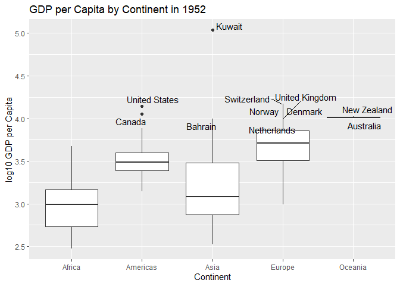
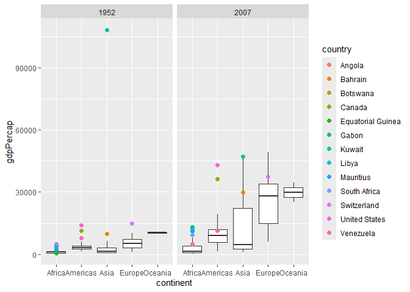
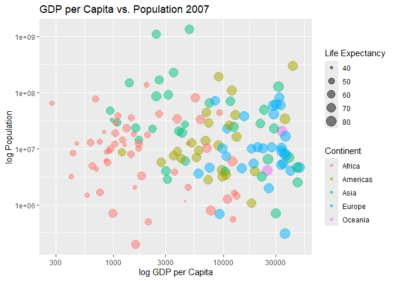

Gapminder
================
khor zhi hong
2020-2-3

- [Grading Rubric](#grading-rubric)
  - [Individual](#individual)
  - [Submission](#submission)
- [Guided EDA](#guided-eda)
  - [**q0** Perform your “first checks” on the dataset. What variables
    are in
    this](#q0-perform-your-first-checks-on-the-dataset-what-variables-are-in-this)
  - [**q1** Determine the most and least recent years in the `gapminder`
    dataset.](#q1-determine-the-most-and-least-recent-years-in-the-gapminder-dataset)
  - [**q2** Filter on years matching `year_min`, and make a plot of the
    GDP per capita against continent. Choose an appropriate `geom_` to
    visualize the data. What observations can you
    make?](#q2-filter-on-years-matching-year_min-and-make-a-plot-of-the-gdp-per-capita-against-continent-choose-an-appropriate-geom_-to-visualize-the-data-what-observations-can-you-make)
  - [**q3** You should have found *at least* three outliers in q2 (but
    possibly many more!). Identify those outliers (figure out which
    countries they
    are).](#q3-you-should-have-found-at-least-three-outliers-in-q2-but-possibly-many-more-identify-those-outliers-figure-out-which-countries-they-are)
  - [**q4** Create a plot similar to yours from q2 studying both
    `year_min` and `year_max`. Find a way to highlight the outliers from
    q3 on your plot *in a way that lets you identify which country is
    which*. Compare the patterns between `year_min` and
    `year_max`.](#q4-create-a-plot-similar-to-yours-from-q2-studying-both-year_min-and-year_max-find-a-way-to-highlight-the-outliers-from-q3-on-your-plot-in-a-way-that-lets-you-identify-which-country-is-which-compare-the-patterns-between-year_min-and-year_max)
- [Your Own EDA](#your-own-eda)
  - [**q5** Create *at least* three new figures below. With each figure,
    try to pose new questions about the
    data.](#q5-create-at-least-three-new-figures-below-with-each-figure-try-to-pose-new-questions-about-the-data)

*Purpose*: Learning to do EDA well takes practice! In this challenge
you’ll further practice EDA by first completing a guided exploration,
then by conducting your own investigation. This challenge will also give
you a chance to use the wide variety of visual tools we’ve been
learning.

<!-- include-rubric -->

# Grading Rubric

<!-- -------------------------------------------------- -->

Unlike exercises, **challenges will be graded**. The following rubrics
define how you will be graded, both on an individual and team basis.

## Individual

<!-- ------------------------- -->

| Category | Needs Improvement | Satisfactory |
|----|----|----|
| Effort | Some task **q**’s left unattempted | All task **q**’s attempted |
| Observed | Did not document observations, or observations incorrect | Documented correct observations based on analysis |
| Supported | Some observations not clearly supported by analysis | All observations clearly supported by analysis (table, graph, etc.) |
| Assessed | Observations include claims not supported by the data, or reflect a level of certainty not warranted by the data | Observations are appropriately qualified by the quality & relevance of the data and (in)conclusiveness of the support |
| Specified | Uses the phrase “more data are necessary” without clarification | Any statement that “more data are necessary” specifies which *specific* data are needed to answer what *specific* question |
| Code Styled | Violations of the [style guide](https://style.tidyverse.org/) hinder readability | Code sufficiently close to the [style guide](https://style.tidyverse.org/) |

## Submission

<!-- ------------------------- -->

Make sure to commit both the challenge report (`report.md` file) and
supporting files (`report_files/` folder) when you are done! Then submit
a link to Canvas. **Your Challenge submission is not complete without
all files uploaded to GitHub.**

``` r
library(tidyverse)
```

    ## ── Attaching core tidyverse packages ──────────────────────── tidyverse 2.0.0 ──
    ## ✔ dplyr     1.1.4     ✔ readr     2.1.5
    ## ✔ forcats   1.0.0     ✔ stringr   1.5.1
    ## ✔ ggplot2   3.5.1     ✔ tibble    3.2.1
    ## ✔ lubridate 1.9.4     ✔ tidyr     1.3.1
    ## ✔ purrr     1.0.2     
    ## ── Conflicts ────────────────────────────────────────── tidyverse_conflicts() ──
    ## ✖ dplyr::filter() masks stats::filter()
    ## ✖ dplyr::lag()    masks stats::lag()
    ## ℹ Use the conflicted package (<http://conflicted.r-lib.org/>) to force all conflicts to become errors

``` r
library(gapminder)
```

*Background*: [Gapminder](https://www.gapminder.org/about-gapminder/) is
an independent organization that seeks to educate people about the state
of the world. They seek to counteract the worldview constructed by a
hype-driven media cycle, and promote a “fact-based worldview” by
focusing on data. The dataset we’ll study in this challenge is from
Gapminder.

# Guided EDA

<!-- -------------------------------------------------- -->

First, we’ll go through a round of *guided EDA*. Try to pay attention to
the high-level process we’re going through—after this guided round
you’ll be responsible for doing another cycle of EDA on your own!

### **q0** Perform your “first checks” on the dataset. What variables are in this

dataset?

``` r
## TASK: Do your "first checks" here!

gapminder
```

    ## # A tibble: 1,704 × 6
    ##    country     continent  year lifeExp      pop gdpPercap
    ##    <fct>       <fct>     <int>   <dbl>    <int>     <dbl>
    ##  1 Afghanistan Asia       1952    28.8  8425333      779.
    ##  2 Afghanistan Asia       1957    30.3  9240934      821.
    ##  3 Afghanistan Asia       1962    32.0 10267083      853.
    ##  4 Afghanistan Asia       1967    34.0 11537966      836.
    ##  5 Afghanistan Asia       1972    36.1 13079460      740.
    ##  6 Afghanistan Asia       1977    38.4 14880372      786.
    ##  7 Afghanistan Asia       1982    39.9 12881816      978.
    ##  8 Afghanistan Asia       1987    40.8 13867957      852.
    ##  9 Afghanistan Asia       1992    41.7 16317921      649.
    ## 10 Afghanistan Asia       1997    41.8 22227415      635.
    ## # ℹ 1,694 more rows

``` r
summary(gapminder)
```

    ##         country        continent        year         lifeExp     
    ##  Afghanistan:  12   Africa  :624   Min.   :1952   Min.   :23.60  
    ##  Albania    :  12   Americas:300   1st Qu.:1966   1st Qu.:48.20  
    ##  Algeria    :  12   Asia    :396   Median :1980   Median :60.71  
    ##  Angola     :  12   Europe  :360   Mean   :1980   Mean   :59.47  
    ##  Argentina  :  12   Oceania : 24   3rd Qu.:1993   3rd Qu.:70.85  
    ##  Australia  :  12                  Max.   :2007   Max.   :82.60  
    ##  (Other)    :1632                                                
    ##       pop              gdpPercap       
    ##  Min.   :6.001e+04   Min.   :   241.2  
    ##  1st Qu.:2.794e+06   1st Qu.:  1202.1  
    ##  Median :7.024e+06   Median :  3531.8  
    ##  Mean   :2.960e+07   Mean   :  7215.3  
    ##  3rd Qu.:1.959e+07   3rd Qu.:  9325.5  
    ##  Max.   :1.319e+09   Max.   :113523.1  
    ## 

``` r
colSums(is.na(gapminder))
```

    ##   country continent      year   lifeExp       pop gdpPercap 
    ##         0         0         0         0         0         0

**Observations**:

- Write all variable names here -Country -continent -year -pop(
  population of the country) -gdpPercap(GDP per capita)

No Na data under the heads

### **q1** Determine the most and least recent years in the `gapminder` dataset.

*Hint*: Use the `pull()` function to get a vector out of a tibble.
(Rather than the `$` notation of base R.)

``` r
## TASK: Find the largest and smallest values of `year` in `gapminder`
years <- gapminder %>% pull(year)
year_max <- max(years)
year_min <- min(years)
```

Use the following test to check your work.

``` r
## NOTE: No need to change this
assertthat::assert_that(year_max %% 7 == 5)
```

    ## [1] TRUE

``` r
assertthat::assert_that(year_max %% 3 == 0)
```

    ## [1] TRUE

``` r
assertthat::assert_that(year_min %% 7 == 6)
```

    ## [1] TRUE

``` r
assertthat::assert_that(year_min %% 3 == 2)
```

    ## [1] TRUE

``` r
if (is_tibble(year_max)) {
  print("year_max is a tibble; try using `pull()` to get a vector")
  assertthat::assert_that(False)
}

print("Nice!")
```

    ## [1] "Nice!"

### **q2** Filter on years matching `year_min`, and make a plot of the GDP per capita against continent. Choose an appropriate `geom_` to visualize the data. What observations can you make?

You may encounter difficulties in visualizing these data; if so document
your challenges and attempt to produce the most informative visual you
can.

``` r
## TASK: Create a visual of gdpPercap vs continent

gapminder_min_year <- gapminder %>%
  filter(year == year_min)

gapminder_min_year %>%
  ggplot(aes(continent, gdpPercap)) +
  geom_boxplot() +
  labs(
    title = paste("GDP per Capita by Continent", year_min),
    x     = "Continent",
    y     = "GDP per Capita"
  )
```

<!-- -->

``` r
gapminder_min_year %>%
  ggplot(aes(continent, log10(gdpPercap))) +
  geom_boxplot() +
  labs(
    title = paste("Log10 GDP per Capita by Continent", year_min),
    x     = "Continent",
    y     = "Log10 GDP per Capita"
  )
```

<!-- -->

**Observations**:

- Write your observations here -the boxplot are all squished together
  and close to zero -there is a very large outlier in asia -most of the
  countries in all the continent are below 15000 gdpPercap -both africa
  and asia seems to have the low median GDP per capita

**Difficulties & Approaches**:

- Write your challenges and your approach to solving them challenge:
  -the boxplot are all squished together and hard to visualise the data
  -but boxplot is still a good way to visualise the data as it shows the
  median GDP per capita and the range and outliers. And by putting them
  side by side can give a better comparison of the mentioned variables
  approach: -since dataset is squished together can use logarithm
  transformation to make the dataset more distributed and return the
  data in specific base

### **q3** You should have found *at least* three outliers in q2 (but possibly many more!). Identify those outliers (figure out which countries they are).

``` r
## TASK: Identify the outliers from q2

library(ggrepel)

gapminder %>% 
  filter(year == year_min) %>% 
  mutate(is_outlier = gdpPercap %in% boxplot.stats(gdpPercap)$out) %>% 
  ggplot(aes(continent, log10(gdpPercap))) +
  geom_boxplot() +
  geom_text_repel(
    data = . %>% filter(is_outlier),
    aes(label = country),
    max.overlaps = Inf
  ) +
  labs(
    title = paste("GDP per Capita by Continent in", year_min),
    x = "Continent",
    y = "log10 GDP per Capita"
  )
```

<!-- -->

**Observations**:

- Identify the outlier countries from q2 following are the few countires
  that exited the whiskers of their continent boxplot and can be seen on
  the boxplot -Kuwait -United states & Canada

honorable mentions that are outside the boxplot iqr -Bahrain
-Switzerland -united kingdom -Netherlands -New Zealand

``` r
# gapminder_min_year <- gapminder %>%
#   filter(year == year_min)
# 
# iqr <- IQR(gapminder_min_year$gdpPercap)
# 
# q1 <- quantile(gapminder_min_year$gdpPercap, 0.25)
# q3 <- quantile(gapminder_min_year$gdpPercap, 0.75)
# lower_bound <- q1 - 1.5 * iqr
# upper_bound <- q3 + 1.5 * iqr
# 
# outlier_countries <- gapminder_min_year %>%
#   filter(gdpPercap < lower_bound | gdpPercap > upper_bound) %>%
#   select(country, gdpPercap)
# 
# outlier_countries
```

*Hint*: For the next task, it’s helpful to know a ggplot trick we’ll
learn in an upcoming exercise: You can use the `data` argument inside
any `geom_*` to modify the data that will be plotted *by that geom
only*. For instance, you can use this trick to filter a set of points to
label:

``` r
## NOTE: No need to edit, use ideas from this in q4 below
gapminder %>%
  filter(year == max(year)) %>%

  ggplot(aes(continent, lifeExp)) +
  geom_boxplot() +
  geom_point(
    data = . %>% filter(country %in% c("United Kingdom", "Japan", "Zambia")),
    mapping = aes(color = country),
    size = 2
  )
```

<!-- -->

### **q4** Create a plot similar to yours from q2 studying both `year_min` and `year_max`. Find a way to highlight the outliers from q3 on your plot *in a way that lets you identify which country is which*. Compare the patterns between `year_min` and `year_max`.

*Hint*: We’ve learned a lot of different ways to show multiple
variables; think about using different aesthetics or facets.

``` r
## TASK: Create a visual of gdpPercap vs continent
year_max <- max(gapminder$year)

gapminder_selected_years <- gapminder %>%
  filter(year %in% c(year_min, year_max))


# initial move but this squish everything together and hard to visualise anything 
# outlier_countries <- gapminder_selected_years %>%
#   filter(lifeExp %in% boxplot.stats(lifeExp)$out) %>%
#   pull(country)


# I did this by min then max individually 
gapminder_selected_years <- gapminder_selected_years %>%
  group_by(year, continent) %>%
  mutate(
    iqr = IQR(gdpPercap),
    q1 = quantile(gdpPercap, 0.25),
    q3 = quantile(gdpPercap, 0.75),
    lower_bound = q1 - 1.5 * iqr,
    upper_bound = q3 + 1.5 * iqr
  )

outlier_countries <- gapminder_selected_years %>%
  filter(gdpPercap < lower_bound | gdpPercap > upper_bound) %>%
  pull(country)
# by putting gapminder_selected_years it does not put two legends for two separate years 


ggplot(gapminder_selected_years, aes(x = continent, y = gdpPercap)) +
  geom_boxplot() +
  geom_point(
    data = gapminder_selected_years %>% filter(country %in% outlier_countries),
    aes(color = country),
    size = 2
  ) +
    facet_wrap(~year)
```

<!-- -->

``` r
  labs(title = "GDP per Capita by Continent for min and max years",
       x = "Continent",
       y = "GDP per Capita") 
```

    ## $x
    ## [1] "Continent"
    ## 
    ## $y
    ## [1] "GDP per Capita"
    ## 
    ## $title
    ## [1] "GDP per Capita by Continent for min and max years"
    ## 
    ## attr(,"class")
    ## [1] "labels"

**Observations**:

- Write your observations here( i did the min outliers then max
  outliers, one by one as it will squish the data, then i double checked
  with the code below)

  -there are 11 countries that are outside of the whiskers of the
  boxplot of their own continent -the GDP per capita in 1952 is
  relatively low for most continents which maybe due to the volatile
  state of the financial world -over the 55 years the economic disparity
  within the continents and across the continents have increase greatly
  -Asia Europe and Oceania have seen greater increase in the GDP over
  the years -the outlier Kuwait have show lower GDP per capita which
  maybe due to the changing economic situation over the years as
  technology improves -Oceania and Europe shows highest GDP per capita
  among the other continent and remained that way over the years -Africa
  remains the lowest gdp per capita and does not show much improvement
  over 55 years which may be due to the geography as other continent
  ahve shown significant improvements

# Your Own EDA

<!-- -------------------------------------------------- -->

Now it’s your turn! We just went through guided EDA considering the GDP
per capita at two time points. You can continue looking at outliers,
consider different years, repeat the exercise with `lifeExp`, consider
the relationship between variables, or something else entirely.

### **q5** Create *at least* three new figures below. With each figure, try to pose new questions about the data.

Is there a relationship between GDP per capita and population.

``` r
## TASK: Your first graph


gapminder %>%
  filter(year == year_max) %>%
  ggplot(aes(x = gdpPercap, y = pop, size = lifeExp, color = continent)) +
  geom_point(alpha = 0.5) +
  scale_x_log10() +
  scale_y_log10() +
  labs(title = "GDP per Capita vs. Population 2007",
       x = "log GDP per Capita",
       y = "log Population",
       size = "Life Expectancy",
       color = "Continent") 
```

<!-- --> -
(Your notes and observations here) Is there a relationship between GDP
per capita and population.

-Countries with higher GDP per capita tend to have higher life
expectancy (larger circles)

-With many countries having large populations but lower life
expectancy.But there is no strong link between gdp per capita as some
countries with higher gdp per capita have much smaller life expectancy.
same situation for population

-Asia has some of the most populous countries, and its life expectancy
seems to be relatively similar to those countries in Europe and Americas
despite having lower gdp per capita. The population size seems to have
poor link with the life expectancy for asia.

-The Americas and Europe generally have higher GDP per capita with
moderate population sizes.

-there seems to be very weak link between population and gdp per capita

How has life expectancy changed across continents over the years?

``` r
## TASK: Your second graph

gapminder %>%
  ggplot(aes(x = year, y = lifeExp, color = continent)) +
  geom_line(stat = "summary", fun = "mean") +
  labs(title = "Average Life Expectancy Over Time by Continent",
       x = "Year",
       y = "Life Expectancy",
       color = "Continent") 
```

<!-- -->

- (Your notes and observations here) How has life expectancy changed
  across continents over the years?

-The graph shows that life expectancy has generally increased across all
continents from 1950 to 2000.

-The rate of improvement varies: -Africa had the lowest life expectancy
initially and, while it has improved, its growth appears to slow down in
later years. -Oceania and Europe have consistently high life expectancy
and have a steady increase. -Americas and Asia started at lower levels
but have significant improvements over time.

How does the distribution of life expectancy and GDP per capita vary
across continents in 1952 and 2007?

``` r
## TASK: Your third graph


year_max <- max(gapminder$year)
year_min <- min(gapminder$year)


gapminder_selected_years <- gapminder %>%
  filter(year %in% c(year_min, year_max))


outlier_countries <- gapminder_selected_years %>%
  filter(lifeExp %in% boxplot.stats(lifeExp)$out) %>%
  pull(country)


gapminder_selected_years %>%                     
  ggplot(aes(continent, lifeExp)) +
  geom_boxplot() +
  geom_point(
    data = gapminder_selected_years %>%          
      filter(country %in% outlier_countries),
    aes(color = country),
    size = 2
  ) +
  facet_wrap(~ year) +
  labs(
    title = "Life Expectancy by Continent for Min and Max Years",
    x     = "Continent",
    y     = "Life Expectancy",
    color = "Outlier Country"
  )
```

<!-- -->

``` r
gapminder_selected_years <- gapminder %>%
  filter(year %in% c(year_min, year_max))


gapminder_selected_years <- gapminder_selected_years %>%
  group_by(year, continent) %>%
  mutate(
    iqr = IQR(lifeExp),
    q1 = quantile(lifeExp, 0.25),
    q3 = quantile(lifeExp, 0.75),
    lower_bound = q1 - 1.5 * iqr,
    upper_bound = q3 + 1.5 * iqr
  )


outlier_countries <- gapminder_selected_years %>%
  filter(lifeExp < lower_bound | lifeExp > upper_bound) %>%
  select(country, lifeExp, continent, year)

print(outlier_countries)
```

    ## # A tibble: 4 × 4
    ## # Groups:   year, continent [4]
    ##   country     lifeExp continent  year
    ##   <fct>         <dbl> <fct>     <int>
    ## 1 Afghanistan    43.8 Asia       2007
    ## 2 Haiti          60.9 Americas   2007
    ## 3 Reunion        52.7 Africa     1952
    ## 4 Turkey         43.6 Europe     1952

- (Your notes and observations here)

How does the distribution of life expectancy and GDP per capita vary
across continents in 1952 and 2007?

-Afghanistan life have not increase significantly as compared to the
countries in asia, being an outlier of Life Expectancy: 43.828 years.
This maybe due to the conflicts and geography of afghanistan.

- Reunion in 1952 have Life Expectancy: 52.724 year, which is much
  higher than the rest of the countries in afica, which maybe due to the
  slightly better living condition from the better gdp per capita

-in 1952 Europe and Oceania had the highest median life expectancies,
while Africa had the lowest.

-in 2007 Life expectancy increased across all continents, with Europe
and Oceania still leading, and Africa showing significant improvement
but still lagging behind other continents.

-Specific outliers are marked as points outside the whiskers of the box
plots are Afghanistan, Haiti, Reunion, and Turkey.
