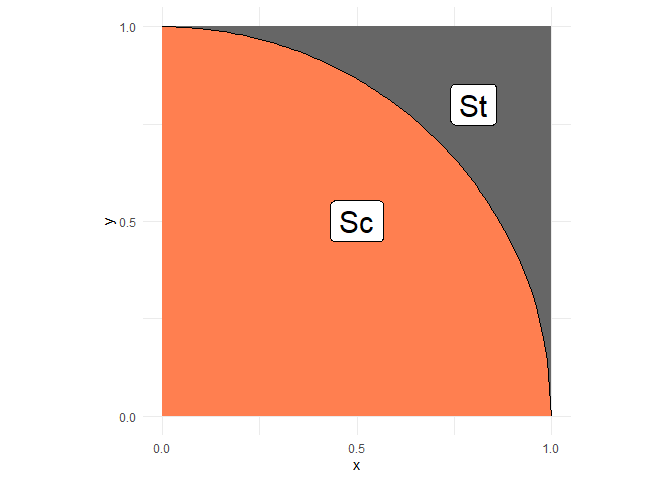
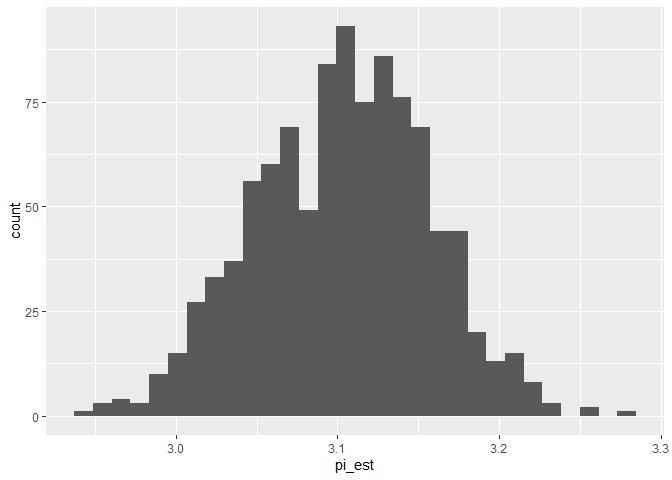

Estimating Pi With a Shotgun
================
Khor Zhi Hong
2020-3-25

- [Grading Rubric](#grading-rubric)
  - [Individual](#individual)
  - [Submission](#submission)
- [Monte Carlo](#monte-carlo)
  - [Theory](#theory)
  - [Implementation](#implementation)
    - [**q1** Generate a uniform random sample on the unit
      square](#q1-generate-a-uniform-random-sample-on-the-unit-square)
    - [**q3** Estimate $\pi$](#q3-estimate-pi)
  - [Quantifying Uncertainty](#quantifying-uncertainty)
    - [**q4** Simulation-based
      inference](#q4-simulation-based-inference)
    - [**q5** Bootstrap percentile confidence
      interval](#q5-bootstrap-percentile-confidence-interval)
    - [**q6** CLT confidence interval](#q6-clt-confidence-interval)
- [References](#references)

*Purpose*: Random sampling is extremely powerful. To build more
intuition for how we can use random sampling to solve problems, we’ll
tackle what—at first blush—doesn’t seem appropriate for a random
approach: estimating fundamental deterministic constants. In this
challenge you’ll work through an example of turning a deterministic
problem into a random sampling problem, and practice quantifying
uncertainty in your estimate.

<!-- include-rubric -->

# Grading Rubric

<!-- -------------------------------------------------- -->

Unlike exercises, **challenges will be graded**. The following rubrics
define how you will be graded, both on an individual and team basis.

## Individual

<!-- ------------------------- -->

| Category | Needs Improvement | Satisfactory |
|----|----|----|
| Effort | Some task **q**’s left unattempted | All task **q**’s attempted |
| Observed | Did not document observations, or observations incorrect | Documented correct observations based on analysis |
| Supported | Some observations not clearly supported by analysis | All observations clearly supported by analysis (table, graph, etc.) |
| Assessed | Observations include claims not supported by the data, or reflect a level of certainty not warranted by the data | Observations are appropriately qualified by the quality & relevance of the data and (in)conclusiveness of the support |
| Specified | Uses the phrase “more data are necessary” without clarification | Any statement that “more data are necessary” specifies which *specific* data are needed to answer what *specific* question |
| Code Styled | Violations of the [style guide](https://style.tidyverse.org/) hinder readability | Code sufficiently close to the [style guide](https://style.tidyverse.org/) |

## Submission

<!-- ------------------------- -->

Make sure to commit both the challenge report (`report.md` file) and
supporting files (`report_files/` folder) when you are done! Then submit
a link to Canvas. **Your Challenge submission is not complete without
all files uploaded to GitHub.**

``` r
library(tidyverse)
```

    ## ── Attaching core tidyverse packages ──────────────────────── tidyverse 2.0.0 ──
    ## ✔ dplyr     1.1.4     ✔ readr     2.1.5
    ## ✔ forcats   1.0.0     ✔ stringr   1.5.1
    ## ✔ ggplot2   3.5.1     ✔ tibble    3.2.1
    ## ✔ lubridate 1.9.4     ✔ tidyr     1.3.1
    ## ✔ purrr     1.0.2     
    ## ── Conflicts ────────────────────────────────────────── tidyverse_conflicts() ──
    ## ✖ dplyr::filter() masks stats::filter()
    ## ✖ dplyr::lag()    masks stats::lag()
    ## ℹ Use the conflicted package (<http://conflicted.r-lib.org/>) to force all conflicts to become errors

``` r
library(rsample)
```

*Background*: In 2014, some crazy Quebecois physicists estimated $\pi$
with a pump-action shotgun\[1,2\]. Their technique was based on the
*Monte Carlo method*, a general strategy for turning deterministic
problems into random sampling.

# Monte Carlo

<!-- -------------------------------------------------- -->

The [Monte Carlo
method](https://en.wikipedia.org/wiki/Monte_Carlo_method) is the use of
randomness to produce approximate answers to deterministic problems. Its
power lies in its simplicity: So long as we can take our deterministic
problem and express it in terms of random variables, we can use simple
random sampling to produce an approximate answer. Monte Carlo has an
[incredible
number](https://en.wikipedia.org/wiki/Monte_Carlo_method#Applications)
of applications; for instance Ken Perlin won an [Academy
Award](https://en.wikipedia.org/wiki/Perlin_noise) for developing a
particular flavor of Monte Carlo for generating artificial textures.

I remember when I first learned about Monte Carlo, I thought the whole
idea was pretty strange: If I have a deterministic problem, why wouldn’t
I just “do the math” and get the right answer? It turns out “doing the
math” is often hard—and in some cases an analytic solution is simply not
possible. Problems that are easy to do by hand can quickly become
intractable if you make a slight change to the problem formulation.
Monte Carlo is a *general* approach; so long as you can model your
problem in terms of random variables, you can apply the Monte Carlo
method. See Ref. \[3\] for many more details on using Monte Carlo.

In this challenge, we’ll tackle a deterministic problem (computing
$\pi$) with the Monte Carlo method.

## Theory

<!-- ------------------------- -->

The idea behind estimating $\pi$ via Monte Carlo is to set up a
probability estimation problem whose solution is related to $\pi$.
Consider the following sets: a square with side length $1$ ($S_t$), and
a quarter-circle ($S_c$).

``` r
## NOTE: No need to edit; this visual helps explain the pi estimation scheme
tibble(x = seq(0, 1, length.out = 100)) %>%
  mutate(y = sqrt(1 - x^2)) %>%

  ggplot(aes(x, y)) +
  annotate(
    "rect",
    xmin = 0, ymin = 0, xmax = 1, ymax = 1,
    fill = "grey40",
    size = 1
  ) +
  geom_ribbon(aes(ymin = 0, ymax = y), fill = "coral") +
  geom_line() +
  annotate(
    "label",
    x = 0.5, y = 0.5, label = "Sc",
    size = 8
  ) +
  annotate(
    "label",
    x = 0.8, y = 0.8, label = "St",
    size = 8
  ) +
  scale_x_continuous(breaks = c(0, 1/2, 1)) +
  scale_y_continuous(breaks = c(0, 1/2, 1)) +
  theme_minimal() +
  coord_fixed()
```

    ## Warning: Using `size` aesthetic for lines was deprecated in ggplot2 3.4.0.
    ## ℹ Please use `linewidth` instead.
    ## This warning is displayed once every 8 hours.
    ## Call `lifecycle::last_lifecycle_warnings()` to see where this warning was
    ## generated.

<!-- -->

The area of the set $S_c$ is $\pi/4$, while the area of $S_t$ is $1$.
Thus the probability that a *uniform* random variable over the square
lands inside $S_c$ is the ratio of the areas, that is

$$\mathbb{P}_{X}[X \in S_c] = (\pi / 4) / 1 = \frac{\pi}{4}.$$

This expression is our ticket to estimating $\pi$ with a source of
randomness: If we estimate the probability above and multiply by $4$,
we’ll be estimating $\pi$.

We can estimate probabilities by taking an average; in our case
$\mathbb{P}_{X}[X \in S_c] = \mathbb{E}[I_{X \in S_c}]$, where
$I_{X \in S_c}$ is the *indicator function*. The indicator function
takes $I = 1$ when $X \in S_c$, and $I = 0$ otherwise.

To ensure we are estimating $\pi$ (and not $\pi/4$), we’ll need to
re-arrange our equation a bit,

$$\pi = \mathbb{E}[4 I_{X \in S_c}],$$

where $\mathbb{E}[Y]$ is syntax for taking the average of $Y$.

## Implementation

<!-- ------------------------- -->

Remember in `e-stat02-probability` we learned how to estimate
probabilities as the limit of frequencies. Use your knowledge from that
exercise to generate Monte Carlo data.

### **q1** Generate a uniform random sample on the unit square

Pick a sample size $n$ and generate $n$ points *uniform randomly* in the
square $x \in [0, 1]$ and $y \in [0, 1]$.

``` r
## TASK: Choose a sample size and generate samples
n <- 1000
set.seed(101)
df_q1 <- data.frame(
  x = runif(n, min = 0, max = 1),
  y = runif(n, min = 0, max = 1)
)
```

Use the following to check that you’ve used the correct variable names.
(NB. This does not check correctness.)

``` r
## NOTE: Do not edit this code
# Correct sample size
assertthat::assert_that(
  dim(df_q1) %>% 
    .[[1]] == n,
  msg = "The sample size should be `n`"
)
```

    ## [1] TRUE

``` r
# Correct column names
assertthat::assert_that(
  setequal(names(df_q1), c("x", "y")),
  msg = "df_q1 must include the columns `x` and `y`"
)
```

    ## [1] TRUE

``` r
print("Good")
```

    ## [1] "Good"

\###**q2** Write a helper function

Write a helper function `stat(x, y)` whose average (of the data from
`q1`), will be $\pi$. Implement a test for correctness of your
implementation, based on the equation

$$\pi = \mathbb{E}[4 \times I_{X \in S_c}].$$

*Hint*: The average of `stat()` needs to converge to $\pi$. You can’t
adjust `stat()` after taking an average, otherwise your answers will be
*wrong*.

Answer the questions below.

``` r
## TASK: Finish implementing this function
stat <- function(x, y) {
  return(4 * as.numeric(x^2 + y^2 <= 1))
}
```

Implement your own assert statements. They should pass using your
implementation of `stat()`, *but* they should also be *correct*.

``` r
## TASK: Finish writing these assert statements

# Check the value for points *inside* the circle
assertthat::assert_that(
    tibble(x = 0.5, y = 0.5) %>% # Pick a point *inside* the circle
    mutate(stat = stat(x, y)) %>% 
    pull(stat) %>% 
    .[[1]] == 4,
  msg = "Incorrect value when a point is inside the circle"
)
```

    ## [1] TRUE

``` r
# Check the value for points *outside* the circle
assertthat::assert_that(
    tibble(x = 1, y = 1) %>% # Pick a point *outside* the circle
    mutate(stat = stat(x, y)) %>% 
    pull(stat) %>% 
    .[[1]] == 0,
  msg = "Incorrect value when a point is outside the circle"
)
```

    ## [1] TRUE

``` r
print("Your assertions passed, but make sure they're checking the right thing!")
```

    ## [1] "Your assertions passed, but make sure they're checking the right thing!"

*Observations*

- You chose a correct value of `stat(x, y)` when `x, y` is *outside* the
  circle. Why did you choose this value?
  - in q1 our unit square is 1 and area being pi/4, thus count points in
    the circle and multiply by 4 to get a converge to pi -for xy is
    outside the circle, the value returns a zero. since the equation is
    x^2 + y^2\<=1 (smaller than unit square), when x=1 and y=1 = 2 thus
    larger than unit square of 1, lying outside the circle and 4X0=0.
- You chose a correct value of `stat(x, y)` when `x, y` is *inside* the
  circle. Why did you choose this value?
  - same as above, when x=0.5 and y=0.5, area is
    0.5<sup>2+0.5</sup>2=0.5 which is \<1, thus lying in the circle,
    return 1 and 4X1=4.

### **q3** Estimate $\pi$

Using your data in `df_q1`, estimate $\pi$.

``` r
## TASK: Estimate pi using your data from q1
df_q3 <- 
  df_q1 %>% 
  mutate(pi_est = stat(x, y)) %>%
  summarise(pi_est = mean(pi_est))
df_q3
```

    ##   pi_est
    ## 1    3.1

Use the following to check that you’ve used the correct variable names.
(NB. This does not check correctness.)

``` r
## NOTE: Do not edit this code
# Correct sample size
assertthat::assert_that(
  dim(df_q3) %>% 
    .[[1]] == 1,
  msg = "This result should have just one row"
)
```

    ## [1] TRUE

``` r
# Correct column names
assertthat::assert_that(
  setequal(names(df_q3), c("pi_est")),
  msg = "df_q3 must include the column `pi_est`"
)
```

    ## [1] TRUE

``` r
print("Good")
```

    ## [1] "Good"

## Quantifying Uncertainty

<!-- -------------------------------------------------- -->

You now have an estimate of $\pi$, but how trustworthy is that estimate?
In `e-stat06-clt` we discussed *confidence intervals* as a means to
quantify the uncertainty in an estimate. Now you’ll apply that knowledge
to assess your $\pi$ estimate.

### **q4** Simulation-based inference

Complete the code below to perform a bootstrap resample of your $\pi$
estimate. Answer the questions below.

``` r
## TASK: Finish the code below
df_q4 <- 
  df_q1 %>% 
  bootstraps(., times = 1000) %>% 
  mutate(
    pi_est = map_dbl(
      splits,
      function(split_df) {
        analysis(split_df) %>% 
          mutate(pi_est = stat(x, y)) %>%
          summarise(pi_est = mean(pi_est)) %>%
          # Estimate pi (pi_est) using the resampled data;
          # this should be *identical* to the
          # code you wrote for q3
          pull(pi_est)
      }
    )
  )

## NOTE: Do not edit; use this to visualize your results
df_q4 %>% 
  ggplot(aes(pi_est)) +
  geom_histogram()
```

    ## `stat_bin()` using `bins = 30`. Pick better value with `binwidth`.

<!-- -->

``` r
# quantile(df_q4$pi_est, probs = c(0.00, 1))
```

*Observations*

- What is a range of plausible values, based on the sampling
  distribution you’ve generated?
  - the range of possible values are \[2.9,3.289\], with the center
    distribution about 3.12~3.14, and as the value deviate further from
    3.12~3.14 the number of values decreases.

### **q5** Bootstrap percentile confidence interval

Compute a bootstrap confidence interval for $\pi$ at the 95% confidence
level (`alpha = 0.05`).

*Hint*: You learned how to do this in `e-stat05-inference` and
`e-stat06-clt`.

``` r
## TASK: Compute a bootstrap confidence interval at the 95% level (alpha = 0.05)
df_q5 <- 
  df_q4 %>% 
  summarize(
    # TODO: Compute pi_lo and pi_up
    pi_lo = quantile(pi_est, probs = 0.025), # i think need to 0.05/2 or is it overthink?
    pi_up = quantile(pi_est, probs = 0.975)
  )

df_q5
```

    ## # A tibble: 1 × 2
    ##   pi_lo pi_up
    ##   <dbl> <dbl>
    ## 1     3  3.20

### **q6** CLT confidence interval

Compute a CLT-based confidence interval for $\pi$ at the 95% confidence
level (`alpha = 0.05`). Answer the questions below, comparing with your
answer to `q5`.

*Hint 1*: You learned how to do this in `e-stat05-inference` and
`e-stat06-clt`.

*Hint 2*: You have computed the same thing (a 95% confidence interval)
in both q5 and q6. If they disagree strongly, that suggests that you’ve
done something *wrong* in one of the tasks….

``` r
# df_q1 %>%
df_q1 %>%
  mutate(pi_est = stat(x, y)) %>%
  summarize(
    pi_hat = mean(pi_est),
    se = sd(pi_est) / sqrt(n()),
    pi_lo = pi_hat - 1.95 * se,
    pi_up = pi_hat + 1.95 * se
  )
```

    ##   pi_hat         se    pi_lo    pi_up
    ## 1    3.1 0.05284688 2.996949 3.203051

``` r
# HMM i didnt get the hint but i used what is in e-stat07
# df_clt %>%
#   filter(
#     n > 1,
#     id <= 100
#   ) %>%
#   mutate(
#     se = sd / sqrt(n),
#     lo = mean - z_c * se,
#     hi = mean + z_c * se
#   ) %>%
# 
#   ggplot(aes(id)) +
#   geom_hline(yintercept = 0.5, linetype = 2) +
#   geom_errorbar(aes(
#     ymin = lo,
#     ymax = hi,
#     color = (lo <= 0.5) & (0.5 <= hi)
#   )) +
#   facet_grid(n~.) +
#   scale_color_discrete(name = "CI Contains True Mean") +
#   theme(legend.position = "bottom") +
#   labs(
#     x = "Replication",
#     y = "Estimated Mean"
#   )
```

**Observations**:

- Does your intervals include the true value of $\pi$?
  - (Bootstrap CI: yes or no?) YES
  - (CLT CI: yes or no?) YES
- How closely do your bootstrap CI and CLT CI agree?
  - very close, bootstrap \[3,3.204\] while CLT CI is \[2.997, 3.203\],
    with bootstrap CI having slightly higher for pi_lo and pi_hi
- Comment on the width of your CI(s). Would your estimate of $\pi$ be
  good enough for roughly estimating an area (e.g., to buy enough paint
  for an art project)? Would your estimate of $\pi$ be good enough for
  precisely calculating a trajectory (e.g., sending a rocket into
  orbit)? both bootstrap and CLT have width of 0.204 and 0.206
  respectively
  - (Good enough as a rough estimate?)with the error of about 3.246% it
    is good enough for rough estimation
  - (Good enough as a precise estimate?) Nope the rocket will have a
    good chance of crash lol
- What would be a *valid* way to make your CI more narrow?
  - the SE decreases as number of sample size increases, so by
    increasing the number of sample size can reduce the width

# References

<!-- -------------------------------------------------- -->

\[1\] Dumoulin and Thouin, “A Ballistic Monte Carlo Approximation of Pi”
(2014) ArXiv, [link](https://arxiv.org/abs/1404.1499)

\[2\] “How Mathematicians Used A Pump-Action Shotgun to Estimate Pi”,
[link](https://medium.com/the-physics-arxiv-blog/how-mathematicians-used-a-pump-action-shotgun-to-estimate-pi-c1eb776193ef)

\[3\] Art Owen “Monte Carlo”,
[link](https://statweb.stanford.edu/~owen/mc/)
